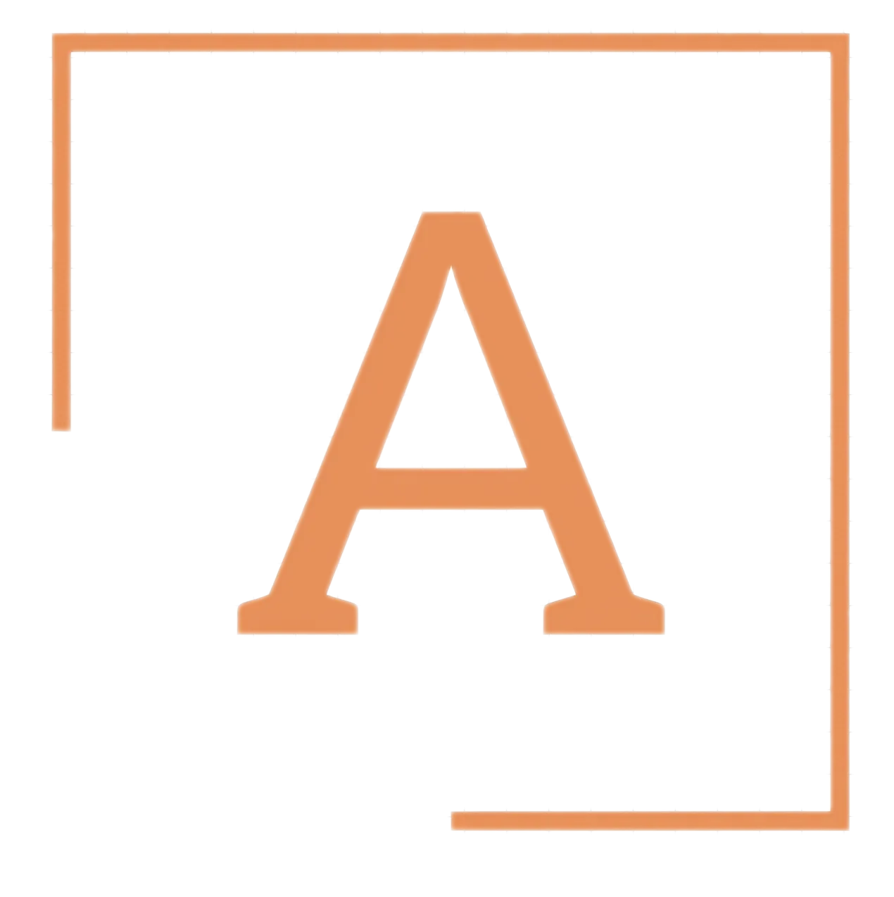

# Abflags

---

<p align="center"></p>
<p align="center">Open Source Feature Flagging and A/B Testing</p>

---

## Features

Explore the [documentation](https://docs.abflags.wolfx.app) to discover plenty examples and unlock the full power of Docling!

---

## Installation

To use Abflags, simply install abflags from docker hub, e.g. `docker pull`:

```docker
docker pull abflags/abflags
```
or 
```docker
git clone https://github.com/tecklens/abflags.git
cd abflags
docker-compose up -d
```

---

## Documentation and Support

View the [Abflags](https://docs.abflags.wolfx.app) Docs for info on how to configure and use the platform.

We're here to help - and to make Abflags even better!

---

## Contributors

We ❤️ all contributions, big and small!
Read [CONTRIBUTING.md](/CONTRIBUTING.md) for how to setup your local development environment.

If you want to, you can reach out via [email](mailto:hi.abflags@gmail.com) and we'll set up a pair programming session to get you started.

---

## License

Abflags is an Open Core product. The bulk of the code is under the permissive MIT license, and the `libs/enterprise` directory has its own separate commercial license.
